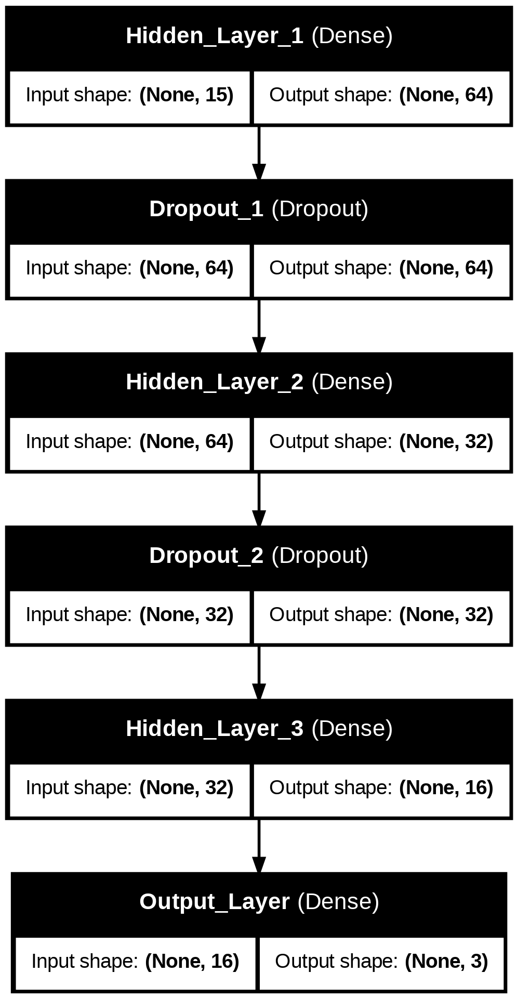

# MediBot Africa: Predicting Malaria, Typhoid, and Pneumonia from Symptoms

## 🎯 Objective
This project explores the implementation of machine learning models with optimization techniques such as regularization, dropout, early stopping, and learning rate adjustments. The goal is to build accurate models that support early diagnosis of common diseases based on symptoms — improving convergence speed, efficiency, and generalization performance.

---

## 📌 Problem Statement
Millions in underserved African regions suffer from preventable diseases due to late diagnoses. This model supports early detection of **Malaria**, **Typhoid**, and **Pneumonia** using 15 binary symptom indicators, such as fever, headache, and cough.

---

## 📊 Dataset

## Source: [https://www.kaggle.com/datasets/miltonmacgyver/symptom-based-disease-prediction-dataset/data](https://www.kaggle.com/datasets/miltonmacgyver/symptom-based-disease-prediction-dataset/data)

| Description     | Value                                |
|------------------|--------------------------------------|
| Source           | Kaggle              |
| Total Samples    | 4,998                                |
| Features         | 15 binary symptoms                   |
| Target Classes   | 3 (Malaria, Typhoid, Pneumonia)      |

---

## 🧪 Models Implemented

| Model                     | Description                                                   |
|---------------------------|---------------------------------------------------------------|
| **Instance 1 (Baseline)** | Neural Network with no optimization                           |
| **Instance 2**            | RMSprop + Dropout + EarlyStopping                             |
| **Instance 3**            | SGD + L2 Regularization                                       |
| **Instance 4**            | Adam + Dropout + L2 + EarlyStopping                           |
| **Instance 5**            | Logistic Regression (Non-Neural Network, with tuned params)   |

All 5 trained models are saved in the `/saved_models` directory.

---

##  Model Architecture

The neural network architecture used includes:
- **Input Layer**: 15 features
- **Hidden Layers**: 3 fully connected layers (64, 32, 16 neurons) with `relu` activation
- **Dropout**: 0.3 for regularization
- **Output Layer**: 3 neurons (softmax) for multiclass prediction




---

## 📊 Optimization Summary Table (Neural Network Instances)

| Instance | Optimizer  | Regularizer | Epochs | Early Stopping | Layers | Dropout | Learning Rate | Accuracy | Loss    | F1 Score | Recall | Precision |
|----------|------------|-------------|--------|----------------|--------|---------|----------------|----------|---------|----------|--------|-----------|
| 1        | Default    | None        | 20     | ❌ No           | 3      | ❌ No    | -              | 0.8773   | ~0.38   | 0.8772   | 0.8773 | 0.8775    |
| 2        | RMSprop    | None        | 20     | ✅ Yes          | 3      | ✅ 0.3   | 0.001          | 0.8960   | ~0.31   | 0.8958   | 0.8960 | 0.8961    |
| 3        | SGD        | L2 (0.01)   | 20     | ❌ No           | 3      | ❌ No    | 0.001          | 0.8400   | ~0.48   | 0.8390   | 0.8400 | 0.8413    |
| 4        | Adam       | L2 (0.01)   | 20     | ✅ Yes          | 3      | ✅ 0.3   | 0.0005         | 0.9000   | ~0.29   | 0.8997   | 0.9000 | 0.9003    |
| 5*       | -          | -           | -      | -              | -      | -       | -              | 0.8893   | N/A     | 0.8890   | 0.8893 | 0.8892    |

> *Instance 5 is a Logistic Regression model (non-NN). Loss is not applicable.


---


## 📈 Discussion of Results

Each training instance tested a different combination of optimization techniques to improve model performance:

- **Instance 1 (Baseline Neural Network)** used default settings without any optimization. While it achieved decent performance (**87.73% accuracy**), it showed signs of early overfitting and lacked regularization.

- **Instance 2 (RMSprop + Dropout + EarlyStopping)** combined an adaptive optimizer with dropout and early stopping. It significantly improved generalization and achieved **89.60% accuracy**, confirming the impact of adding regularization.

- **Instance 3 (SGD + L2 Regularization)** underperformed compared to others. Despite using L2, the lack of early stopping or dropout, along with SGD's slower convergence, led to **84.00% accuracy** and the weakest F1-score.

- **Instance 4 (Adam + Dropout + L2 + EarlyStopping)** achieved the **best overall performance** with **90.00% accuracy**. This combination stabilized learning, prevented overfitting, and benefited from the lower learning rate. The training and validation loss curves showed smooth convergence, making this model the most robust.

- **Instance 5 (Logistic Regression)**, though a classical ML model, reached **88.93% accuracy**, confirming that linear models still perform very well on structured binary feature sets. It also had balanced precision and recall.

---

### ✅ Best Neural Network:
**Instance 4** – *Adam + Dropout + L2 + EarlyStopping* with **90.00% accuracy**

### 🥇 Best Overall Model:
**Instance 4** – *Optimized Neural Network* outperformed all, including Logistic Regression

---

### 🔍 Takeaway:

- Neural networks perform **best when layered with multiple optimization strategies**, especially combinations like **L2 + Dropout + Adaptive Optimizers (e.g., Adam)** and **EarlyStopping**.
- While classical models like **Logistic Regression** are strong and interpretable, optimized deep learning models can achieve **higher generalization** — especially when designed carefully.


## 🔬 Error Analysis

The model was evaluated using the following metrics on the test set:

- ✅ **Accuracy**
- ✅ **Precision**
- ✅ **Recall**
- ✅ **F1 Score**
- ✅ **Confusion Matrix**
- ✅ **Per-Class Evaluation (Bar Plot)**

```python
from sklearn.metrics import classification_report
print(classification_report(y_test, preds, target_names=le.classes_))
````

📊 Per-class scores were visualized to assess class-specific weaknesses.

---

## 💾 How to Run This Project

1. Clone the repo:

   ```bash
   git clone https://github.com/your-username/MediBot-Africa.git
   cd MediBot-Africa
   ```

2. Open `notebook.ipynb` in Jupyter or Colab and run all cells.

3. Load the best model:

   ```python
   from tensorflow.keras.models import load_model
   model = load_model("saved_models/model_2_rmsprop.keras")
   ```

---

## 🗂️ Project Structure

```
MediBot-Africa/
├── notebook.ipynb
├── README.md
├── saved_models/
│   ├── model_1_baseline.keras
│   ├── model_2_rmsprop.keras
│   ├── model_3_sgd_l2.keras
│   ├── model_4_adam_combo.keras
│   └── model_5_logistic_regression.pkl
├── diagrams/
│   └── model_architecture.png
```

---

## 🎥 Video Presentation

🎬 [Link to 5-Minute Presentation Video](https://drive.google.com/file/d/1wp178XsKSNzvfhy45Y8bEMFU6PnUQKXw/view?usp=sharing)

* Covers: Dataset overview, model architectures, optimization techniques, result analysis, and final conclusions.

---


## 🙌 Author

Prepared by **Kanisa Rebecca Majok Thiak**
BSc Software Engineering, ALU Kigali
Machine Learning Optimization Project – 2025


